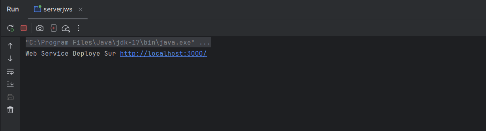
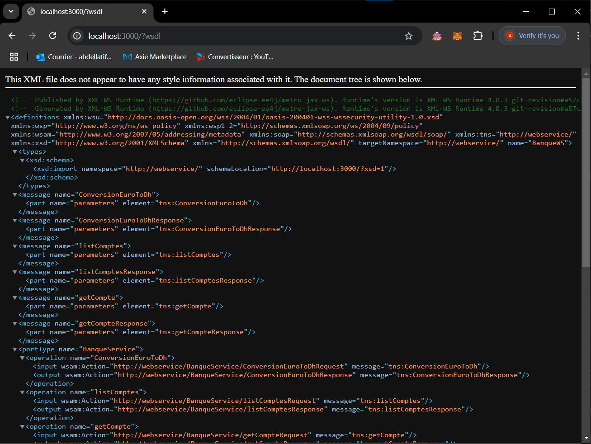
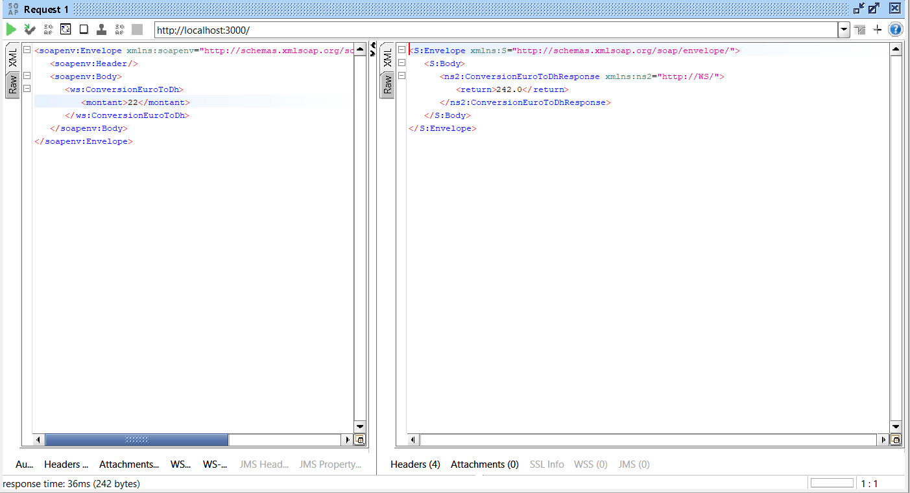
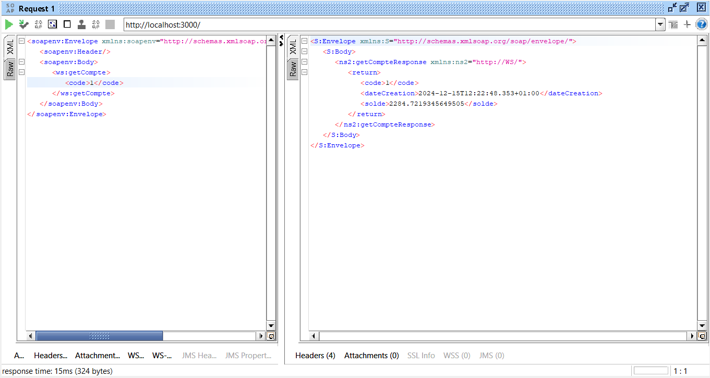
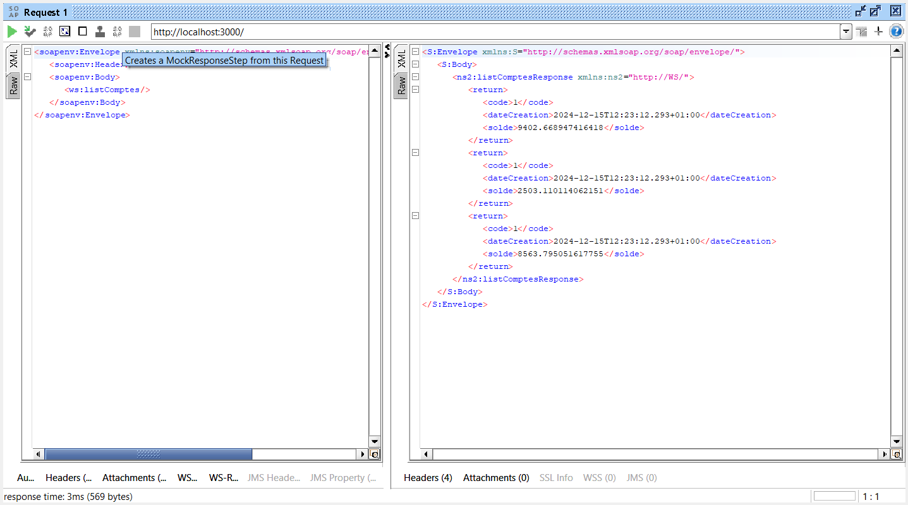
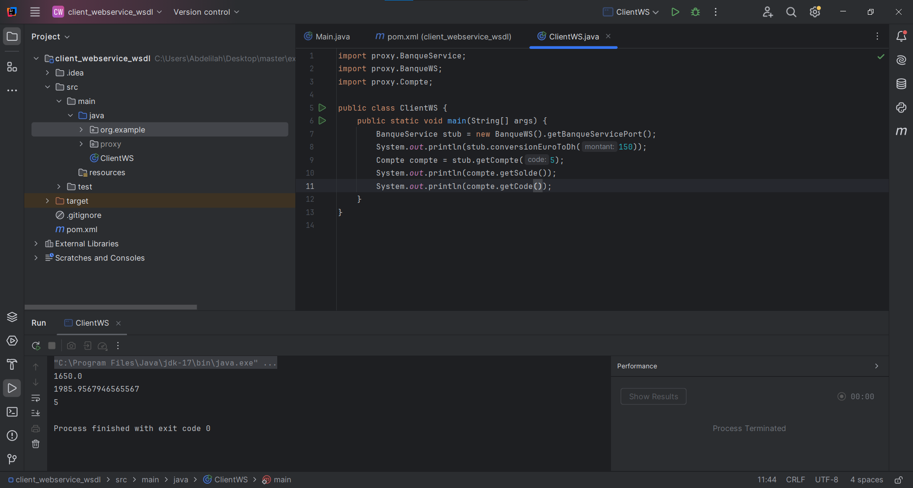

<H2>COMPTE RENDU</H2>
<h4>Deployment du web service</h4>

<h4>Visualisation du WSDL </h4>

<h4>TEST de la methode CONVERSION</h4>

<h4>TEST de la methode GETCOMPTE</h4>

<h4>TEST de la methode LISTCOMPTES</h4>

<h4>Creation du Client SOAP </h4>
